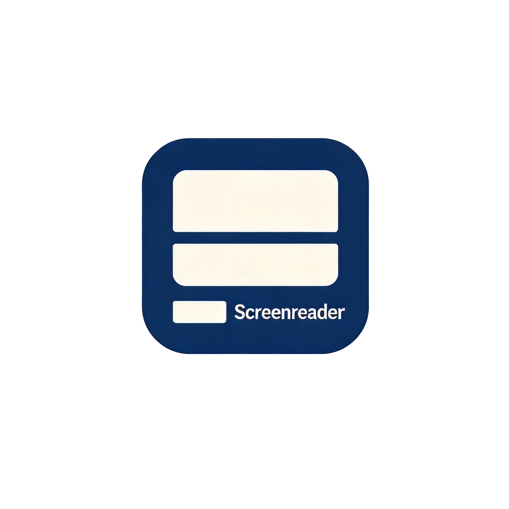
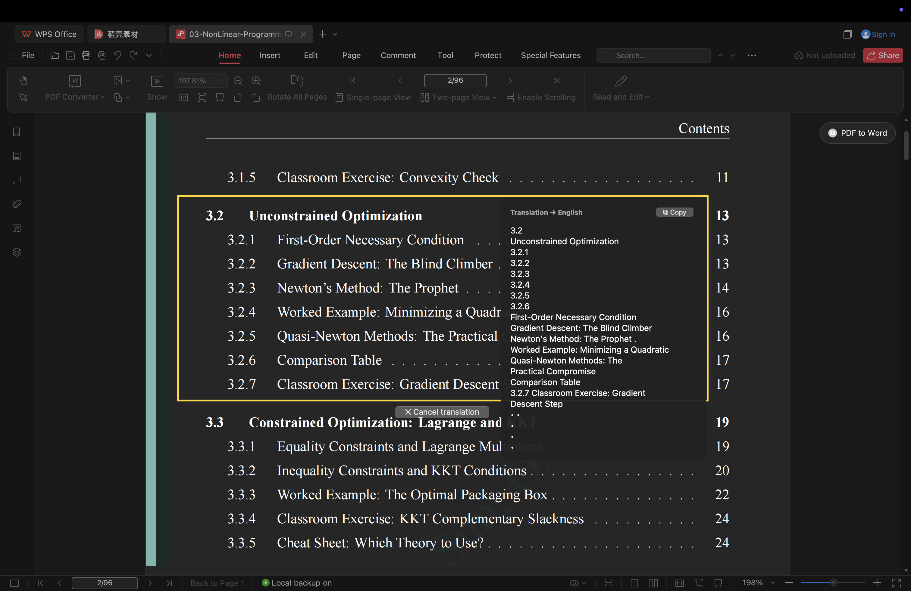
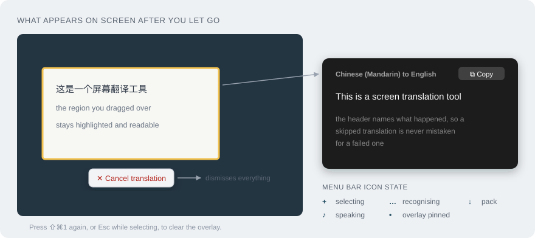
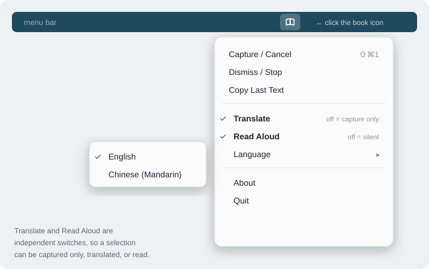
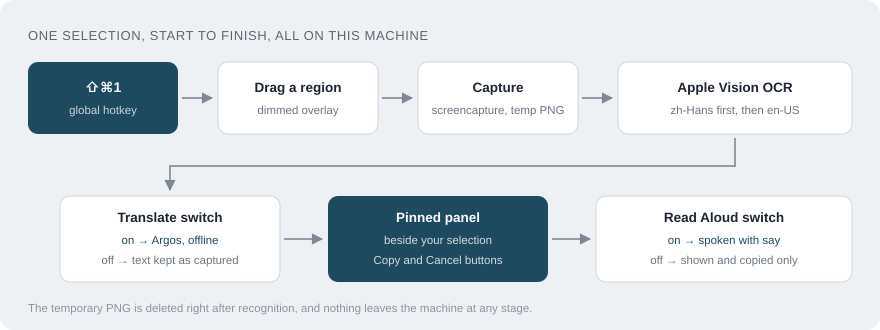

<div align="center">



# Screen Reader

**A tiny macOS menu-bar tool that reads, translates, and speaks any pixels on your screen.**

Press `⇧⌘1`, drag a box over anything (text, a PDF, an image, a caption), and the text inside is recognised on-device, pinned beside your selection, and read aloud.

<br />

[](https://www.apple.com/macos/)
[](https://www.python.org/)
[](https://developer.apple.com/documentation/vision)
[](#macos-permissions-required)
[](#usage)
[](LICENSE)

</div>

---

## What is this

Screen Reader is a menu-bar accessory for macOS. It turns any rectangle you draw on the screen into text you can hear, read, and copy. The recognition uses Apple's Vision framework, the speech uses the built-in `say` command, and the translation uses Argos Translate. All three run on your machine, so nothing you select ever leaves your Mac.

It exists to solve a narrow but common annoyance. Plenty of text on a screen cannot be selected with the cursor. Scanned PDFs, images, video captions, embedded UI labels, and screenshots are all opaque to normal copy and paste. The usual workaround is to retype the text by hand or to paste a screenshot into a web service that ships your pixels to a server. Screen Reader replaces both. You draw a box and the text comes back, spoken and ready to copy, without a network round trip.

It is deliberately small. There is no window to manage, no account, and no cloud. One hotkey drives the whole tool, and each selection reads exactly one area before clearing itself.

## Highlights

- **On-device recognition.** Text is read by Apple's Vision engine locally. No image, no text, and no telemetry is sent anywhere.
- **One hotkey for everything.** `⇧⌘1` starts a selection, and pressing it again cancels the selection, dismisses the pinned result, or stops speech.
- **Spoken aloud automatically.** The recognised text is read with a native macOS voice matched to your chosen language.
- **Pinned beside the selection.** The result sits in a panel next to the area you drew, with the original region kept highlighted for reference.
- **Copy without retyping.** A Copy button puts the text on the clipboard, the panel text is mouse-selectable, and Copy Last Text in the menu recovers the most recent result after dismissing.
- **Offline translation.** The source language is detected automatically and the text is translated into your chosen target before it is shown and spoken, with language packs cached locally after a one-time download.
- **Chinese and English.** Both languages are recognised, translated, and spoken, in either direction.
- **Works over full-screen apps.** The overlay joins every Space, so it appears on top of full-screen windows rather than kicking you back to the desktop.

## Example

Reading a PDF table of contents in WPS Office. Press `⇧⌘1`, drag over the section you want, and the recognised text is pinned in the panel beside the yellow frame, ready to copy.

<div align="center">



</div>

The `⧉ Copy` button puts the text on the clipboard. The `✕ Cancel translation` button below the selection dismisses the overlay, or you can press `⇧⌘1` again.

## Requirements

- macOS 11 Big Sur or newer, since the tool relies on Vision text recognition and the accessory-app APIs
- Python 3.9 or newer, available as `python3`
- Screen Recording and Accessibility permission for whichever app launches the tool, described in [macOS permissions](#macos-permissions-required)

Argos Translate, langdetect, and certifi, all installed automatically by the setup scripts. Language packs download on first use and then work offline.

## Install and run

The quickest path uses the bundled launcher. It creates a local virtualenv on first run and starts the menu-bar tool.

```bash
cd ~/screen-reader
./run.sh
```

Or set it up manually.

```bash
python3 -m venv .venv
./.venv/bin/pip install -r requirements.txt
./.venv/bin/python screenreader.py
```

Either way a small book icon appears in the menu bar once the tool is running. That icon is where you pick the language, trigger a selection, and quit.

## macOS permissions (required)

Grant these to whichever app launches the tool, meaning Terminal, iTerm, or the packaged app, in System Settings under Privacy and Security.

| Permission | Why it is needed |
|------------|------------------|
| Screen Recording | so the selected region can be captured |
| Accessibility | so the global `⇧⌘1` hotkey works |

If the hotkey does not respond, it is almost always the Accessibility permission. After granting it, quit the tool from the menu-bar icon and relaunch it, because permission changes only take effect on a fresh start.

## Usage

Trigger a selection with the hotkey, drag a box over the text you want, and let go. The tool captures that region, recognises the text, speaks it, and pins it beside your selection.

| Shortcut | Action |
|----------|--------|
| `⇧⌘1` while idle | Select an area and read it, one selection per press |
| `⇧⌘1` again | Cancel the selection, dismiss the pinned overlay, or stop speech |
| `Esc` while selecting | Abort the current selection |



You can also trigger, dismiss, and choose the language from the book icon in the menu bar. The same icon shows the current state with a small symbol beside it.

| Symbol | State |
|:------:|-------|
| none | idle |
| `+` | selecting |
| `…` | recognising |
| `↓` | downloading a language pack, first use only |
| `♪` | speaking |
| `•` | overlay pinned |

## Configuration

Click the menu-bar icon and open the Language submenu to choose the spoken and translated language. The default is English.



Two switches in the same menu control what happens to a selection.

| Switch | On | Off |
|--------|----|-----|
| Translate | text is translated into the target language | the recognised text is captured as it is, so the tool works as a plain screen OCR |
| Read Aloud | the result is spoken | the result is only shown and copied |

With Translate off the panel header reads `Recognised text, translation off`, and speech follows the language of the captured text rather than the target. All three choices are written to `~/.screenreader.json` and restored on the next launch.

| File | Purpose |
|------|---------|
| `~/.screenreader.json` | stores the target language, the Translate switch, and the Read Aloud switch |
| `~/Library/Logs/ScreenReader.log` | output of the installed app, useful when something misbehaves |

## How it works

The whole tool is one Python file backed by PyObjC bindings to the native macOS frameworks. A single run does the following.



1. A global hotkey listener from `pynput` catches `⇧⌘1` and toggles the selection state on the main thread.
2. A borderless overlay window dims every screen and lets you rubber-band a rectangle. The overlay is marked as non-capturable, so it never appears in the screenshot itself.
3. The chosen rectangle is captured with the `screencapture` command into a temporary PNG.
4. Apple's Vision framework recognises the text with the accurate recognition level and language correction, then the temporary file is deleted.
5. langdetect identifies the source language and Argos Translate converts the text into your target, pivoting through English when no direct language pack exists. Packs are downloaded once and then cached locally.
6. The result is pinned in a panel beside the original selection with a Copy button and a Cancel button. When Read Aloud is on it is also spoken with `say` using a voice chosen for the target language.

The overlay windows use a collection behaviour that joins all Spaces and full-screen auxiliaries, and the process runs under the accessory activation policy. That combination is the key design decision. It keeps the tool out of the Dock and stops macOS from yanking you out of a full-screen app when the overlay appears.

## Offline translation

Translation is built in and runs on this machine through Argos Translate. Nothing is sent to a server.

Translation runs between Chinese and English only, in either direction. Pick a target language in the menu-bar Language submenu, then select any text on screen. The source language is detected from the characters themselves, so a line of Chinese is never mistaken for another script. The text is translated before it is pinned in the panel, and spoken when Read Aloud is on. The panel header tells you what happened, for example `Chinese to English` when it translated, or `Recognised text, already English` when no translation was needed.

The two language packs are fetched the first time each direction is used, then cached under `~/.local/share/argos-translate` and reused offline forever. The menu-bar icon shows `↓` during that one-time download and a notification names the pair being fetched. Each pack is a few hundred megabytes.

| Situation | What the panel header shows |
|-----------|-----------------------------|
| text was translated | `Chinese to English` |
| source already matches the target | `Recognised text, already English` |
| the pack could not be installed | `Recognised text, no X to Y pack` |
| text is neither Chinese nor English | `Recognised text` |

## Install as a system app

This step is optional. It turns the project into a real menu-bar app that starts at login, with no Terminal window left open.

```bash
./install.sh
```

The script builds `~/Applications/ScreenReader.app` wrapping this project, registers a LaunchAgent so it launches at every login, and starts it immediately. It is idempotent, so re-run it any time to refresh. To reverse everything, run `./uninstall.sh`, which removes the autostart entry and the app bundle while keeping this project folder.

One-time step after installing. Grant Screen Recording, Accessibility, and Input Monitoring if listed, to ScreenReader in System Settings under Privacy and Security. Permissions previously granted to Terminal do not carry over to the new app. Then quit the app from the menu-bar icon and reopen it once. Logs go to `~/Library/Logs/ScreenReader.log` if anything misbehaves.

## Project structure

```text
screen-reader/
├── screenreader.py          The whole app. Menu-bar item, region selector,
│                            Vision OCR, translation, speech, pinned overlay
├── install.sh               Builds ~/Applications/ScreenReader.app and
│                            registers the LaunchAgent for login autostart
├── uninstall.sh             Removes the app bundle and the autostart entry
├── run.sh                   Dev mode. Creates the venv and runs the script
├── requirements.txt         rumps, pynput, pyobjc (Vision and Quartz)
├── assets/
│   ├── logo.png             Source artwork for the app icon
│   ├── AppIcon.icns         Generated multi-resolution app icon
│   ├── menubar_icon.png     Monochrome template icon for the menu bar
│   └── make_menubar_icon.py Regenerates menubar_icon.png
└── docs/
    └── example.png          Screenshot used in this README
```

## Tech stack

- **Python with PyObjC** for direct access to the native macOS frameworks
- **Apple Vision** (`pyobjc-framework-Vision`) for on-device text recognition
- **Quartz and AppKit** for the screen capture, the dimmed selection overlay, and the pinned result windows
- **rumps** for the menu-bar item and its menu
- **pynput** for the global `⇧⌘1` hotkey
- **Argos Translate and langdetect**, for offline translation and language detection

## Limitations and known issues

- macOS only. The tool depends on Vision, `screencapture`, and `say`, none of which exist on other platforms.
- Recognition quality follows Apple Vision. Very small, low-contrast, or heavily stylised text may come back imperfect.
- Translation is off until you install the optional packages and download the language pairs you need.
- The two required permissions must be granted to the exact app that launches the tool, and a permission change only applies after a restart.
- One selection is active at a time. Starting a new one clears the previous overlay and speech.

## Security and privacy

Screen Reader is built to keep your screen content on your machine. Recognition, speech, and translation all run locally, and the captured region is written to a temporary file that is deleted right after recognition. The tool makes no network requests of its own.

The two permissions it asks for are the minimum the feature needs. Screen Recording is required to capture the region you draw, and Accessibility is required for the global hotkey. The only file it writes to your home directory is `~/.screenreader.json`, which stores the selected language index and nothing else. If you find a security issue, please open an issue on the repository.

## License

Released under the MIT License. See [LICENSE](LICENSE) for the full text.

<div align="center">
<br />
<sub>Built with Python, Apple Vision, and rumps. Runs entirely on your Mac.</sub>
</div>
